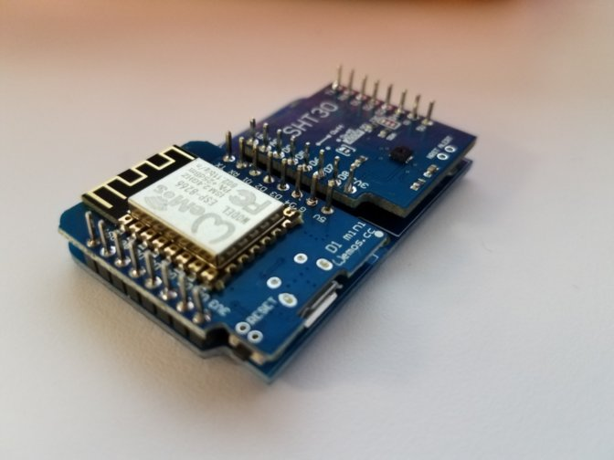

# wemos-mini-templogger
[](https://travis-ci.org/thebentern/wemos-mini-templogger)

PlatformIO project for Wemo D1 Mini and SHT-30 shield
MQTT Temperature and Humidity logging for use with Home Assistant




## Basic installation and usage

* Clone repository

* Install [Platform IO](http://platformio.org/)

* Modify the definitions in main.ino to match your target environment:

#### Wifi connection settings

```cpp
#define WIFI_SSID "MyWifiAp"
#define WIFI_PASSWORD "MyPassword"
```

#### MQTT broker connection settings

```cpp
#define MQTT_ADDRESS IPAddress(192, 168, 2, 59)
#define MQTT_PORT 1883
```
#### MQTT topics

Topics are separate for temperature and relative humidity

```cpp
#define MQTT_TOPIC_TEMPERATURE "home/masterbedroom/temperature"
#define MQTT_TOPIC_HUMIDITY "home/masterbedroom/humidity"
```

#### Reporting interval

The default publish interval is one minute
```cpp
#define ONE_MINUTE 60000
```

* Run Platform IO build scripts:

```cmd
platformio run --target upload
platformio device monitor --baud 9600
```

## Dependencies

[AsyncMqttClient](https://github.com/marvinroger/async-mqtt-client)

[WEMOS_SHT3x_Arduino_Library](https://github.com/wemos/WEMOS_SHT3x_Arduino_Library)

